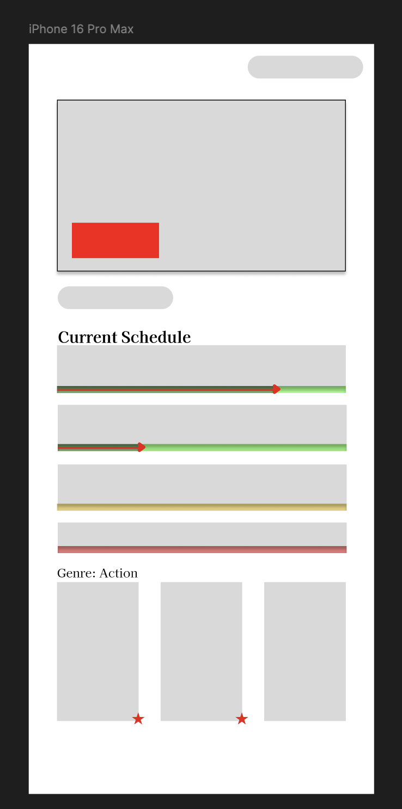
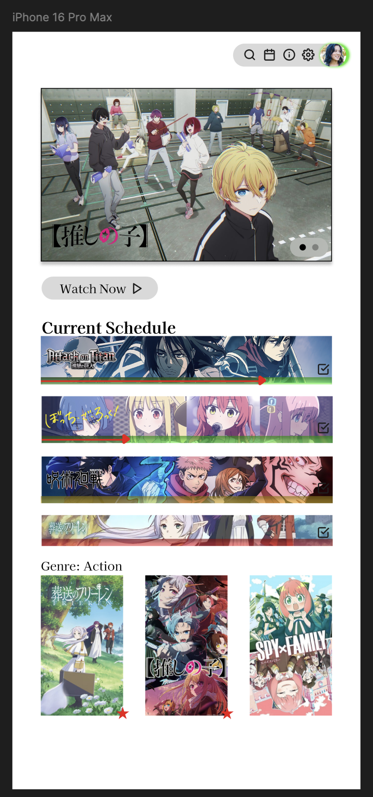

# Nov 16, 2024.
*AnimeTracker*

- Now, I am trying out Figma to create a proper app design for my app
 
- I also asked AI for some features. Here are a list of which where good:
  -  Use AI to find recommendations (I want to learn how to use AI, so this would be good)
  - Calendar integration (be able to sync to Google Calendar, etc.)
  - Smart notifications (for when shows will be released), AI learns when you watch shows!
  - Real-time updates showing most-watched, currently watched, etc. based on user data
  - Have widgets for our app, can add to home screen to see the next release
 
- Here are my ideas:
  - Weekly anime tracking (within the app)
  - Add streaming links, and allow users to add their own custom streaming links
  - Pulling reviews/stars from something like MAL 
  - Make a Chrome extension that syncs with this! You add the sites you watch anime on, and it automatically tracks when you watch a show!
 
- Financial talk:
  - I really don't want this to be a "money-making" app, this is just a chill project that everyone should be able to use for free!
  - No ads!
  - Good idea: We can integrate buying anime convention tickets, etc. through our app.
  - Affiliate links to platforms (i.e. Crunchyroll) to watch anime on
 
- We need a focus on:
  - Very, very simple and easy to use (this is our core!)
  - Clean UI
  - Should be able to sync across multiple devices/accounts, integrate your MAL?
  - Focus on your app being a calendar app for Anime releases (core function), and BUILD upon that. Make it very easy and clean to use

***

## Current home screen design
**Low fidelity**

**High fidelity**

***

- I think I need to "dim" the show's splashes in the calendar &rarr; add a square over the area, and have a dark color, with opacity so you can see through it. 
  - The logos should be above this though
