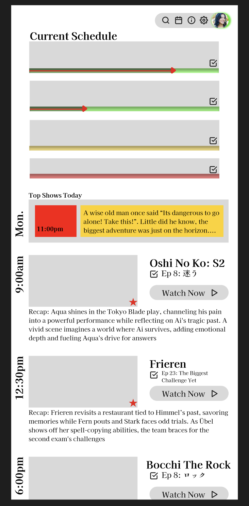
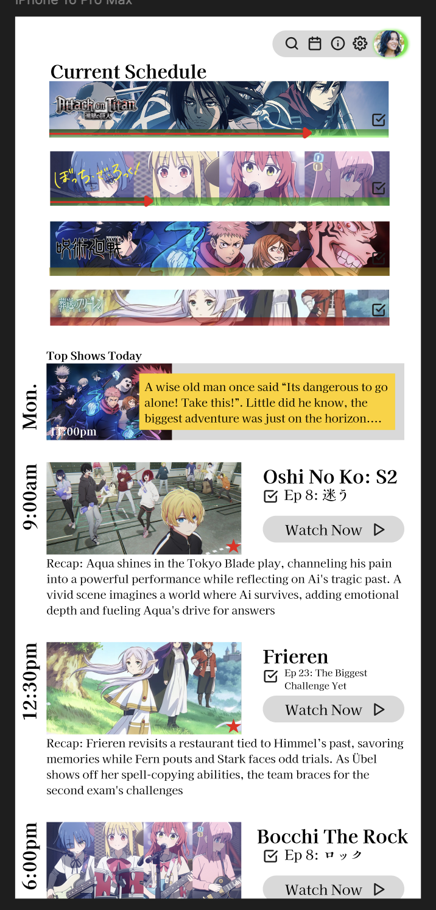
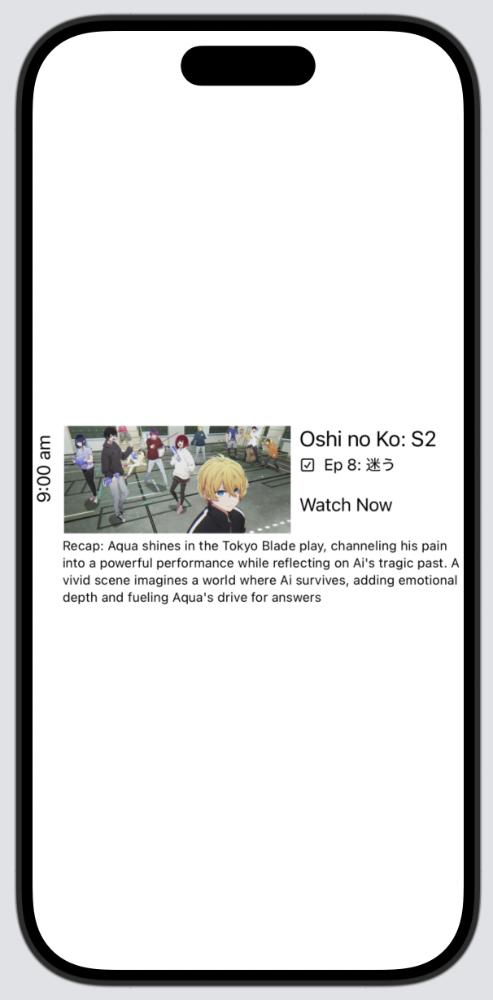

# Nov 23, 2024.
*AnimeTracker*

- Did some more stuff in Figma.
-   Created a "calendar/schedule" mockup

***
**Low fidelity**

**High fidelity**

***

- Using these designs, I started coding the schedue section of the app!

***
**Schedule card in app**

***

- Uploaded project repo to Github now! Xcode will now sync with the GitHub repo (I think lol)

**Next time:**
- Make a view with all shows in the schedule, and make it scrollable
- Find a way to add custom fonts