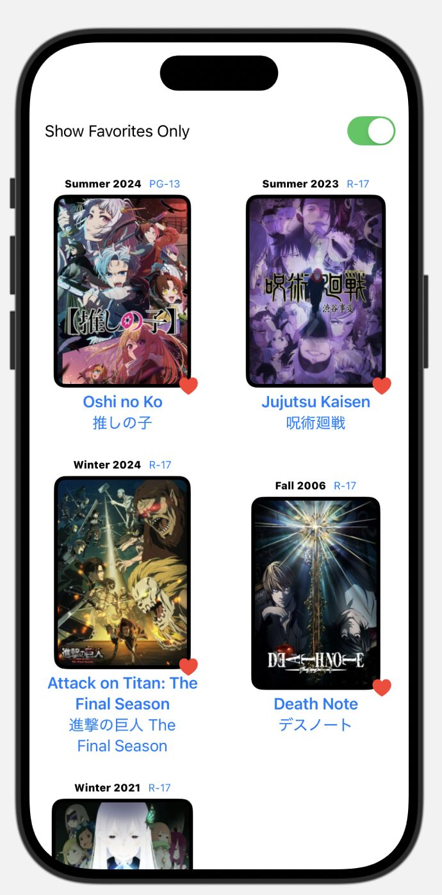

🚀 **Exciting news!** I recently started learning **Swift** and **SwiftUI** to build iOS apps! 💻📱  

I'm currently following **Apple's official guide** to build a **Landmarks app**, getting comfortable with **Swift syntax** and learning how iOS apps are structured.  

As a **side project**, I started applying the concepts I learned in the **Landmarks tutorial** to build my own app: an **Anime Schedule Tracker!** 🎌  

***

### **Why Build This App?**  

It always bothered me that I couldn't conveniently check the **release schedule** for my favorite shows 😤.  
Relying on **random websites** or **Crunchyroll's incomplete schedule** wasn't cutting it.  

So, I thought—why not **create my own** app?  

***

### **💡 Features So Far:**  

✅ Imports shows from a data file 📂  
✅ Dedicated page for each anime 📄  
✅ Ability to favorite anime ⭐  
✅ Sort by favorites for easy access 📊  

***

### **🚀 What's Next?**  

I plan to **add more features soon**, including implementing the **actual schedule page!** 📅  

Let me know what you guys think! 👇  
**Have you ever tried making an app before?** 💬👨‍💻👩‍💻  