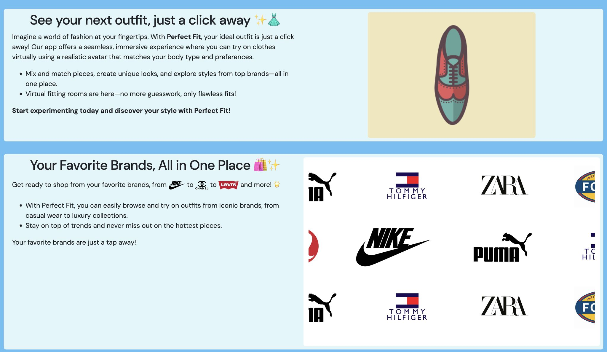

## 🌟 Finished the PerfectFit Home Page! 🌟  

I’m proud to say that I have finished the home page for **PerfectFit**, my team’s mock clothes fitting app website! 🎉  

It isn’t anything special, but it's an experience I can take a lot away from.  

---

## 👥 Lessons from Teamwork  

Working with a team to build this website, I’ve learned the practical importance of **clear communication** and **setting deadlines** 📅.  

Having regular discussions to track each teammate’s progress and align on the site’s vision helped us:  
✅ Develop ideas like the **clothing viewer page** and **scrolling background logos**  
✅ Set **smaller deadlines** to accomplish bigger tasks  
✅ Complete the website **before the deadline: November 12, 2024**  

---

## 🎯 Prioritization & Project Scope  

I originally planned for:  
- ✨ Smooth transitions and animations  
- 📜 Scroll-triggered elements  

However, I learned that **prioritizing key tasks** over adding every feature is crucial. Cutting ✂️ some ideas let me focus on **delivering a polished homepage** instead of an incomplete website.  

---

## 💻 New Skills & Technologies  

During this project, I:  
- ✅ Learned **Git & GitHub** for collaboration  
- ✅ Used **Bootstrap** for layout and styling  
- ✅ Got hands-on experience working in a **team-based web project**  

I'm already applying these skills as a **Software Engineer on the University of Ottawa Supermileage team** 🏎️, and I plan to use them more in personal projects!  

---

## 🚀 What’s Next?  

This project gave me insight into **real-world software engineering**, but I also want to improve:  
🔀 **HTML structure** – Next time, I’ll make it cleaner and more maintainable.  
🎨 **Better animations & transitions** – I need to research this further.  
🛠️ **New technologies** – My next projects will use:  
   - **Tailwind CSS** & **SASS** for styling  
   - **React** with **Next.js** for building scalable web apps  

I also plan to **fork 🍴 this repository** and turn PerfectFit into a real product in the future. But for now, I’m focusing on:  
1. **Building my portfolio site** with modern web tech  
2. **Continuing my Anime App project** for more development experience  

---

## 💬 Your Thoughts?  

👉 **Check out the PerfectFit site here:**  
[Visit PerfectFit](https://seg-perfect-fit.github.io/perfect-fit-site/)

Have you done web development before?  
Did you use frameworks like **Next.js** or libraries like **React**?  
Is there anything you want to learn in the future?  

Let me know in the comments! 😄 
