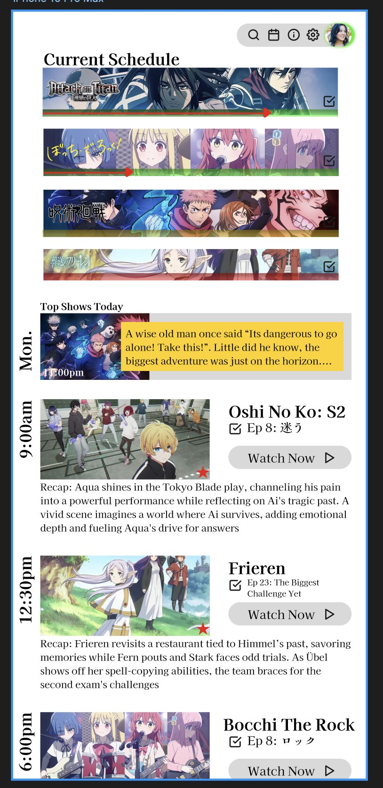
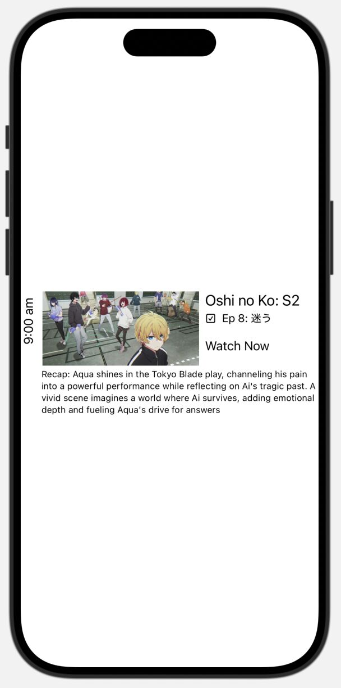
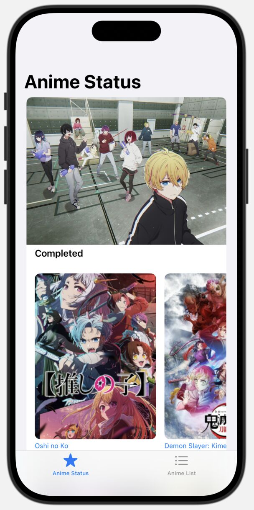

## 👋 Hey! It’s been a while, but I’m still working on my Anime Schedule App! 🎉  

Over these past few weeks, I’ve been busy:  

✨ **I continued following Apple’s Landmarks tutorial project** and learned how to create animations, transitions, and more complex interfaces. Using what I learned, I added a **new page** to my app: view by show status! 📺  

✨ I also **read up on the basics of Swift** as a language itself. Reading the documentation helped me understand how Swift works and how SwiftUI uses Swift features like closures (aka Lambdas or anonymous functions in other languages). Thanks to a stronger foundation, I feel more confident using SwiftUI! 💪  

🎨 **My friend, Samuel Leone Ganado**, showed me Harmony, his team’s Software Engineering website project. I noticed they were using **Figma** to showcase a mock app (which looked super realistic!), so I decided to also give it a try and see how it worked.  

🚀 **Figma is amazing**. It really is. It helped me grasp mobile and UX design and allowed me to visualize my ideas as an actual app. Thanks to Figma, I was able to **design a home screen and schedule screen!** I’ll definitely keep using it and recommend giving it a try if you haven’t (it’s free).  

***

## 📅 Progress with My Anime Tracker App  

Until recently, my Anime Tracker App was simply taking what I learned from the Landmarks tutorial and adding my own spin to it. But on **November 23**, I started my own **custom page** using what I learned from:
- The Landmarks tutorial
- My improved understanding of Swift/SwiftUI
- My Figma designs

And… it was **surprisingly easy**! I was able to implement my Figma concept, not perfectly, but it’s there 😄. 

***

## 🎯 What's Next for the Anime Tracker App?

Here are the next big features I plan to add to my app:
- 📅 **Weekly anime release calendar** (main feature)
- 📚 **Integration with anime databases** like MyAnimeList or AniList
- 🤖 **AI or ML-powered anime recommendations** and episode recaps
- 🏆 **"Most watched" and "currently watching" leaderboard**

***

#### 🎉  It’s truly **super rewarding** to see your learning and hard work pay off, AND to see your vision come to life!  

***

## 💬 Your Thoughts?  

Are you working on any projects? Did you also find it rewarding to see working results? Let me know below!  

PS: I finally figured out how to connect my **GitHub to Xcode** 😂.  

Check out my **[Anime Tracker App](https://github.com/TheBossT910/AnimeTracker)**  