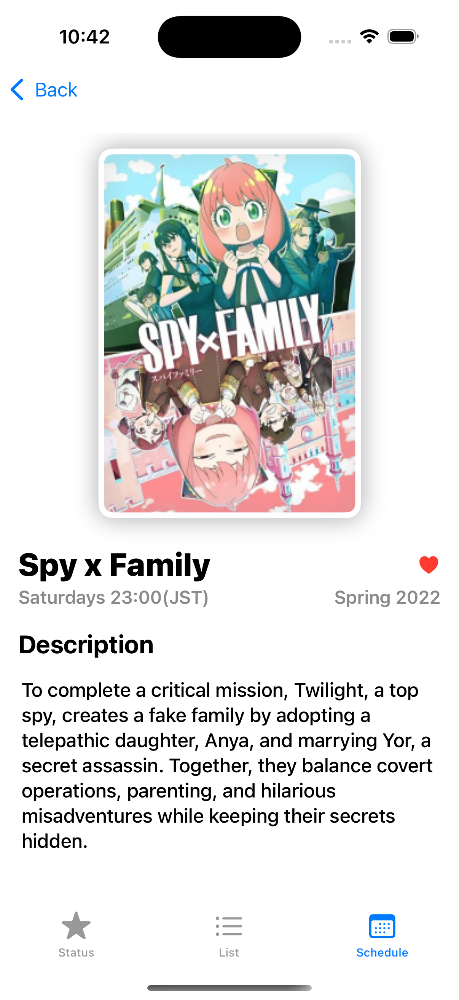
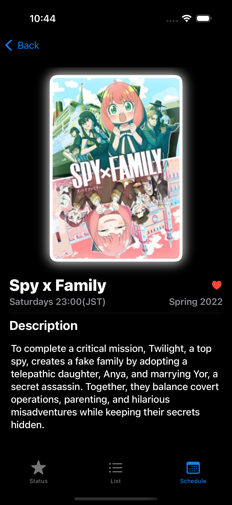
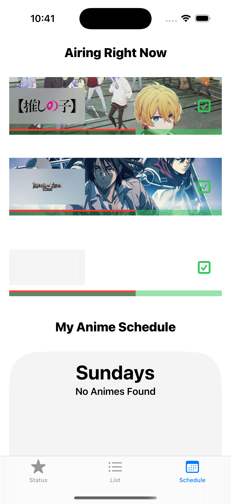
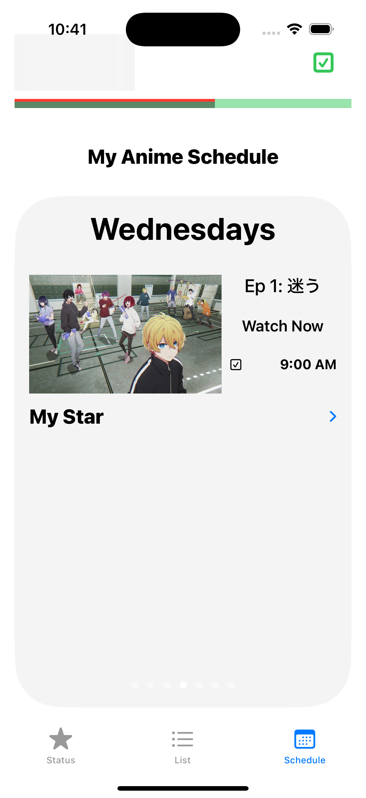
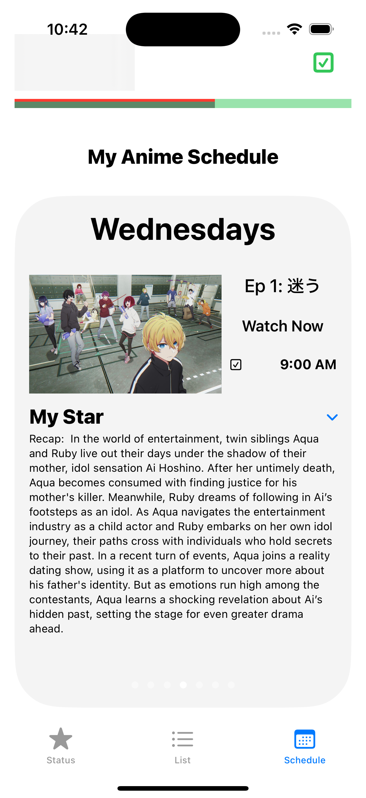
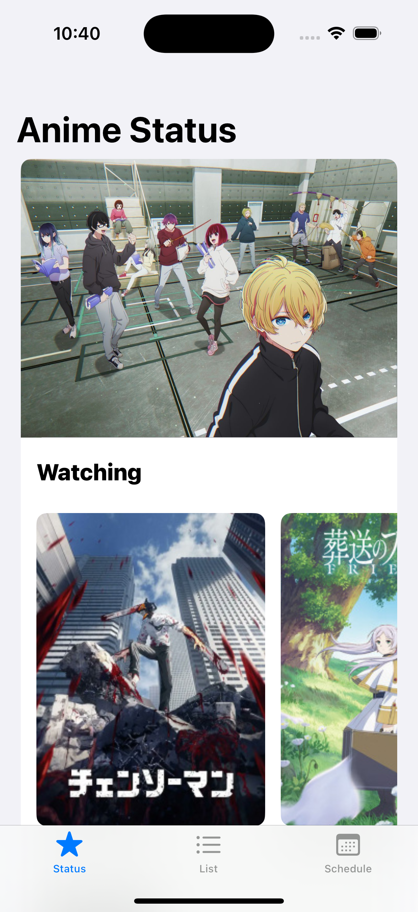

## 🎉 **Major Updates to My AnimeTracker App!** 📱

Hey! I’m back with a **TON** more updates to my **AnimeTracker** app! 🎉📱

So far, I've been focused on finishing the core features of the app (tracking airing shows 📺, user accounts 👤, sync to calendar 📆, fetching fresh anime data 🌟) so I can release the app by **the end of 2025** (yay!). 

There's still a lot to do, but here’s what I’ve accomplished in the past 2 months:

### **AnimeTracker Changes:**
- ✨ Updated app designs
- 🌗 Enabled light/dark modes
- 📱 Ensured compatibility with **ALL modern iPhones/iPads**
- 🔤 Changed font design/weights

***

### **Created a New Page: Schedule Page** 📅
- 🔥 See popular airing shows
- 📜 View your list of shows airing this week, with **custom AI recaps** for **ALL shows** 🤖

***

### **Fetching REAL Data from AniList and TVDB APIs** 🔗
- 📸 Grabs show and episode information, including images and descriptions
- ⚡ Optimized fetching time by **83%** (from 60s to 10s 🚀) using **async functions** and **batch writes to the database**
- ⏳ Spent **15+ hours** creating scripts to retrieve fresh data (still not done yet!)

### **Using Local AI Model (Mistral running on Ollama) for Show Recaps** 🤖📜
- 🛠️ Developed specific prompts to feed the model episode descriptions and get excellent show recaps
- 🧪 Tried multiple AI models (like **ChatGPT-4**, **DeepSeekR1** on Azure), but they didn’t work as expected
- 💰 Azure models and APIs were costly, so I switched to running the **Mistral model** locally via **Ollama** ⚙️

***

### **Debugging, Debugging, Optimizing, Debugging...** 😭🐛

### **Plans:**
- 🚀 Revamp iOS **AnimeTracker** to support new database structure
- 📊 Create more **data-scraping scripts** for currently airing shows, search results, etc.
- ⚡ Optimize **ALL clients** for faster database access (reads/writes)

***

Let me know what you think of my app so far! Any suggestions or feature recommendations? 🤔 

I’d love to hear your feedback! 💡