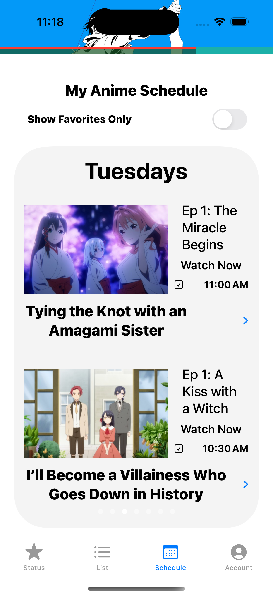
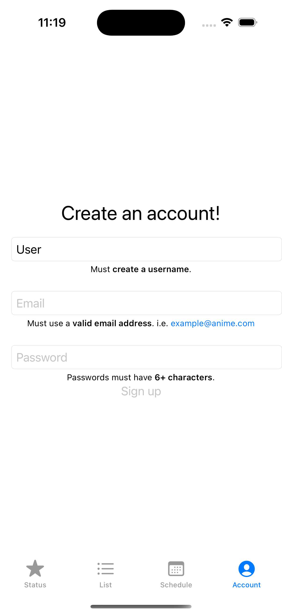
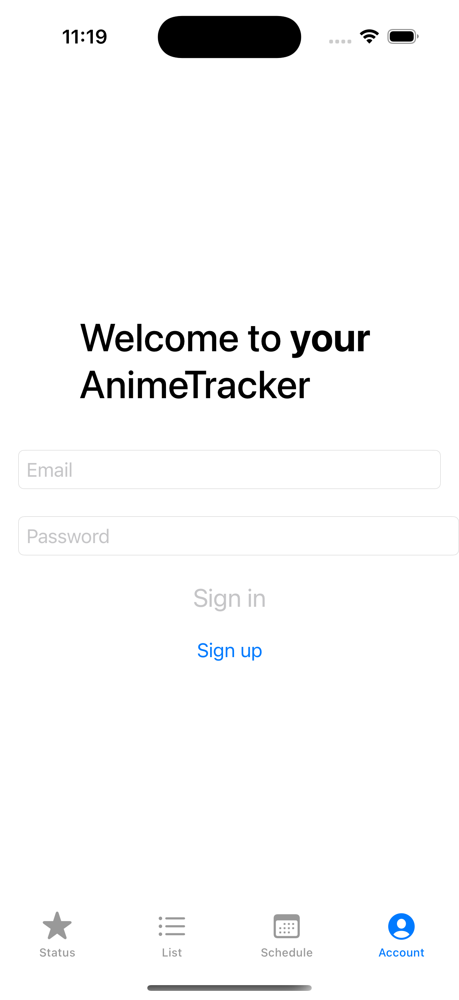
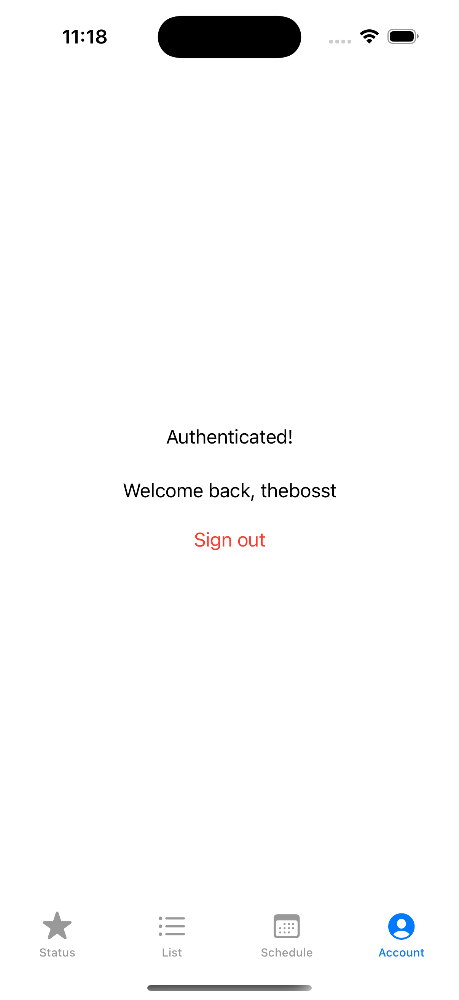
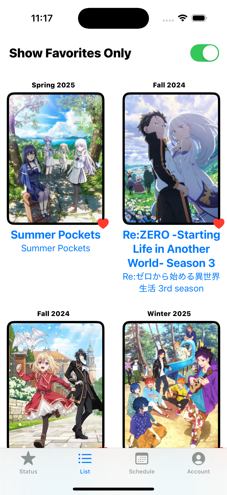

Another month, another update! 🎉

I recently had a great conversation with [Casey Li](https://www.linkedin.com/in/licasey/) about his site, Groundwork UI, and launching apps in general. During our chat, he introduced me to an interesting concept called MVP (Minimum Viable Product), which was new to me.

### What is MVP? 🤔
MVP is exactly what it sounds like: build the bare minimum and launch as quickly as possible. This approach helps developers validate ideas quickly and gather real user feedback to improve the app. By doing so, we get to understand how people use the app and what they value, allowing us to focus on building something that better serves our users.

I initially wanted **AnimeTracker** to be fully polished and feature-rich at launch, but after learning about MVP, I realized that I should launch with just the core features (like tracking shows) and iterate from there. This way, I can build something truly useful for my users, with their feedback guiding the process.

### Key Takeaways 💡
From my conversation with Casey, I learned that sometimes what we think is a "great" idea can be redundant, while what we might consider a "bad" idea could actually become a core feature. This insight really shifted my perspective!

### Recent Progress 📈
After diving deep into the MVP mindset, I went all in and in just **3 days**, I accomplished the following:
- 🛠️ Built an **authentication/account system**
- 📂 Fully migrated to my **new database layout**
- 📺 Added **watchlists**
- 📖 Created **onboarding instructions** for new users
- 🐛 Fixed a ton of small bugs for a smoother user experience

🎉 The result? **AnimeTracker** is almost ready for launch!

### What's Holding Me Back? ⏳
The only reason I'm not launching yet is that I may have gone over the Firebase free tier quota (😅). So, I’ll be optimizing my database usage before the launch, and I should have **V1** ready soon.

And I have a **major surprise** 🔥 coming up, but you’ll have to wait for my next post to find out! 👀

### What About You? 🤔
What do you think of MVP? Do you plan to use it in your next project? Let me know your thoughts in the comments below!