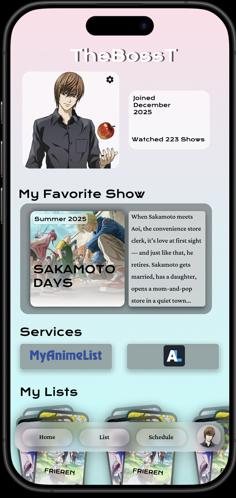
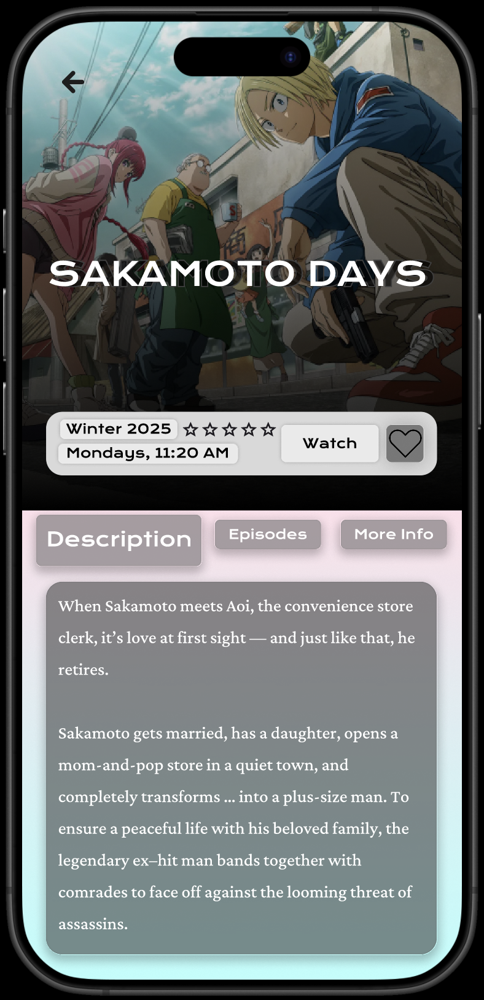
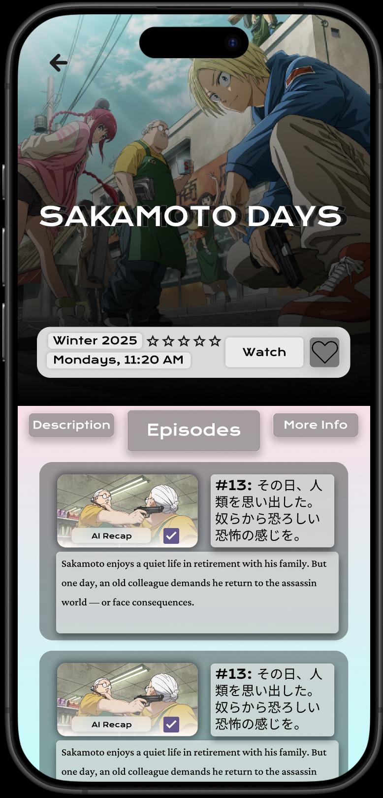
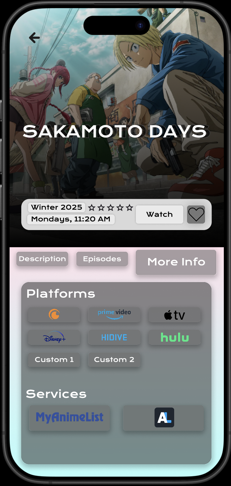
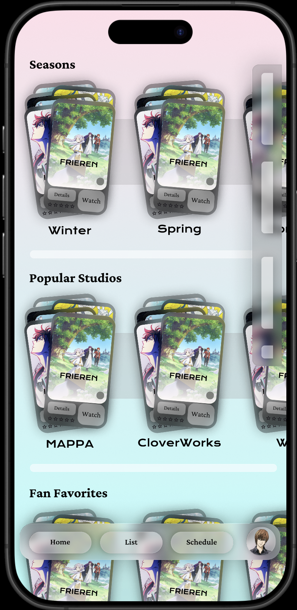
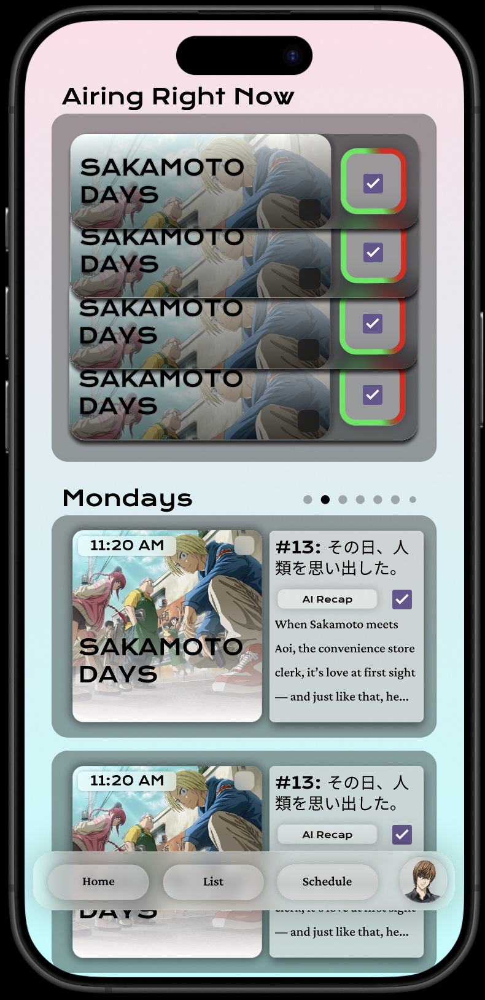
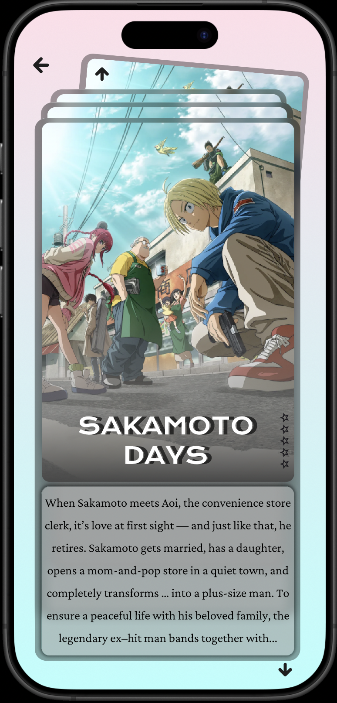
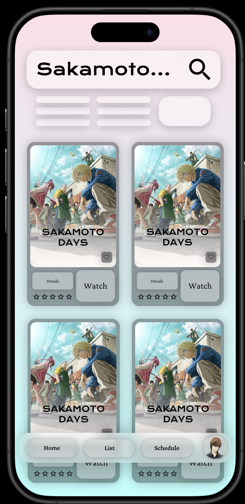
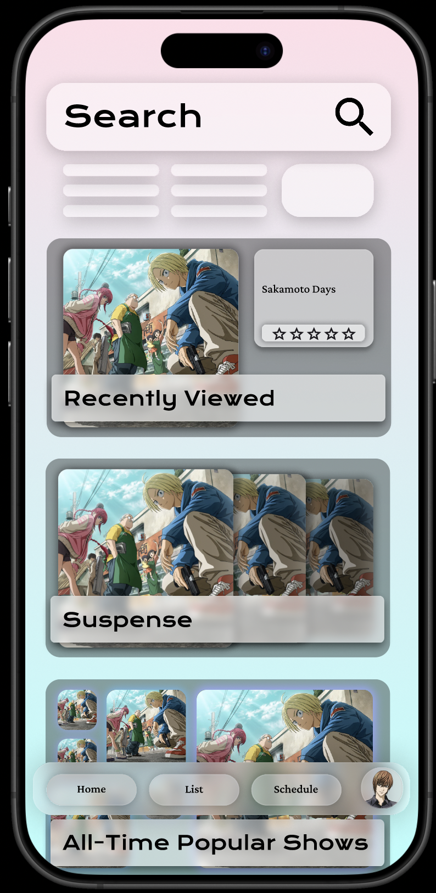

## Surprise! My app has a new look! 😎

Well, not quite yet. In the small free moments I've had between studying for midterms 📚, I've been slowly but surely working on some **new Figma mock-ups** for my **AnimeTracker App**. 

***

### Inspired by VisionOS & Glassmorphism ✨
The new design takes inspiration from **Apple’s VisionOS** 🥽 and a **glassmorphic** aesthetic. The app now has a modern, frosted-glass look that I’m really proud of!

***

### The "Card" Theme 🃏
My design theme revolves around **"cards"**, making the user experience more visual and interactive. Here's how I've incorporated this concept:
- **Shows** are displayed as individual **cards**.
- **Watchlists** are shown as a **stack** of cards.
- **Info cards** provide details about each show.

***

### New Interactive Section 🎞️
I’ve also added a new section inspired by **Instagram’s Reels** 🎞️ and **Steam’s Discovery Queue** 🔎. In this section, users can explore shows in a deck of cards. After a few seconds, the **trailer for each show starts to play** 🎥. Users can then quickly **dismiss** or **add** shows to their watchlists.

### What’s Next? 🚀
I’m excited to refine these designs even further and implement them sooner rather than later. But first, I need to focus on launching the app 😅.

***

👉 I’d love to hear your thoughts and feedback! What could I change? What should I add? Do you like the new design? 

Let me know in the comments below!