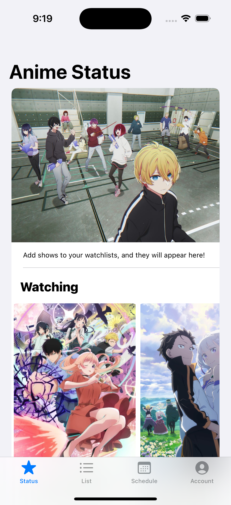
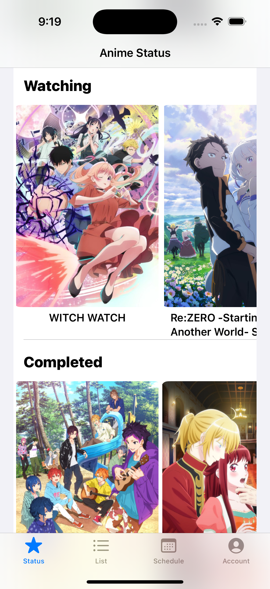
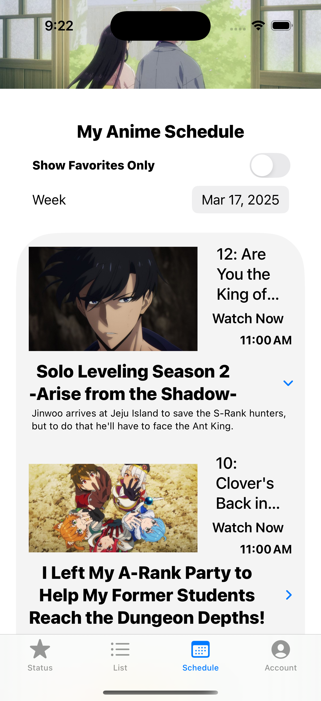
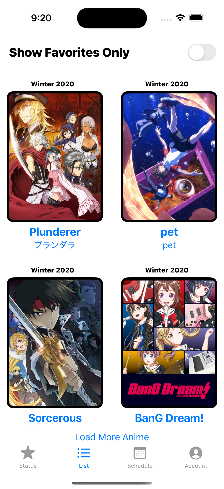
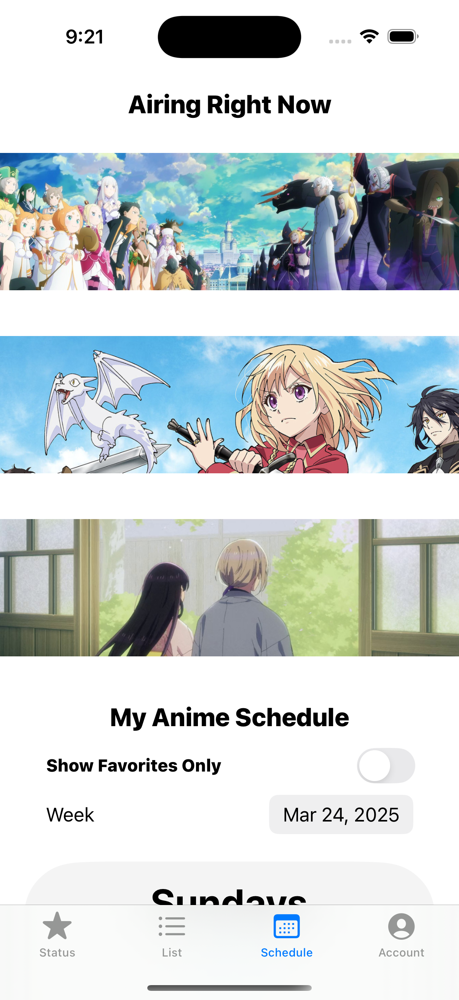

## Have you ever missed the new episode of your favorite show?  
Forgot what shows you were watching, or when they were releasing? Not sure which episodes you've already watched?  

🎉 **Introducing Koyomi – Your Ultimate Anime Tracker!**

Yes, that’s right! After **5+ months of development**, **AnimeTracker** is officially in **beta**, and is now called **Koyomi**!  

📱 **Available on:** iOS, iPadOS, MacOS (Silicon) 💻, and visionOS 🥽  
🔗 **Join the beta here:** [TestFlight Link](https://testflight.apple.com/join/NPUhgzAf)  

## 🔥 Features  

✅ **Track Your Anime** – Add shows to your *Favorites* and organize them into *Watching, Completed, Plan to Watch,* and *Dropped* lists. 
 
📆 **Weekly Release Calendar** – View an up-to-date schedule of anime episodes airing each day.
  
📖 **Anime Details** – Instantly access show descriptions and schedules. 
 

## 🚀 Coming Soon  

1. **Streaming Service Links** – Jump directly to your favorite streaming providers and even add your own!  
2. **AI-Powered Recaps** – Refresh your memory before new episodes drop!  
3. **MAL & AniList Sync** – Seamlessly import your watchlists with Koyomi.  
4. **Episode Progress Tracking** – Check off watched episodes directly from the schedule.  
5. **Sync with Google Calendar** – Never miss an episode again!  
6. **Genre Sorting & Search** – Quickly find the anime that you've always been searching for!  

## 💡 Future Plans  

🌍 **Multi-Platform Support** – Web & Android versions in the works!  
🖥️ **Browser Extension** – Auto-track watched episodes on your go-to streaming platforms.  
🏆 **Leaderboard & Stats** – See your top anime and compete with friends.  

---

Designed **for anime fans, by an anime fan** – **Koyomi** makes it easier than ever to stay on top of your anime schedule.  

📌 **Try it now & never miss an episode again!**  
🔗 **Join the beta here:** [TestFlight Link](https://testflight.apple.com/join/NPUhgzAf)