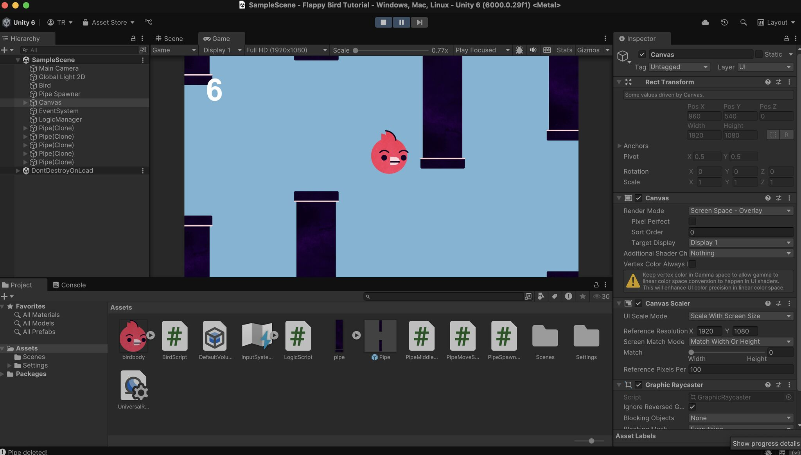
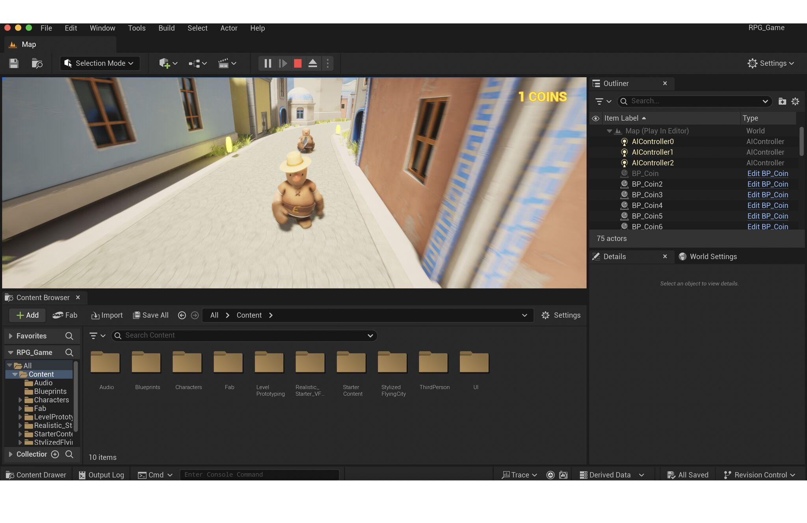
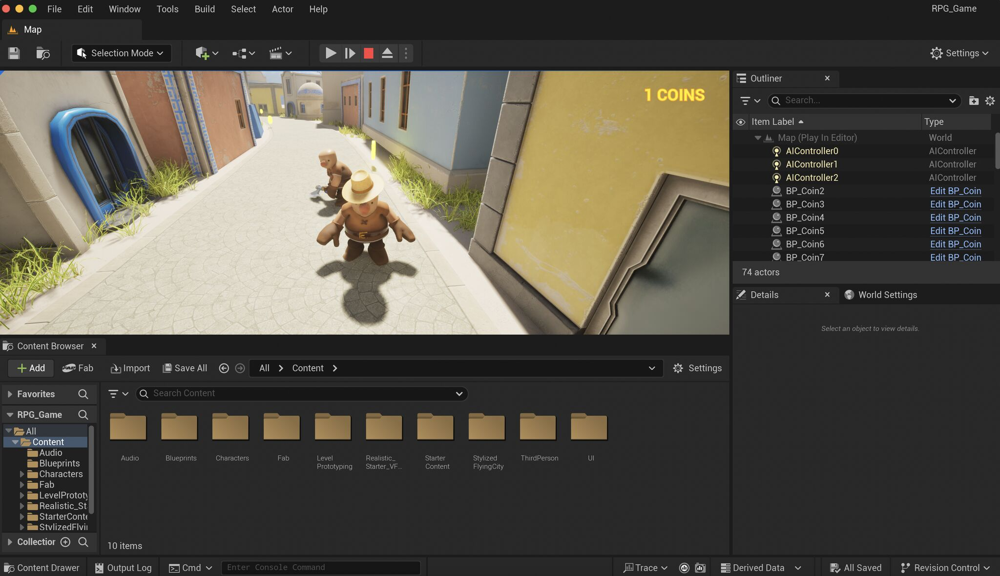
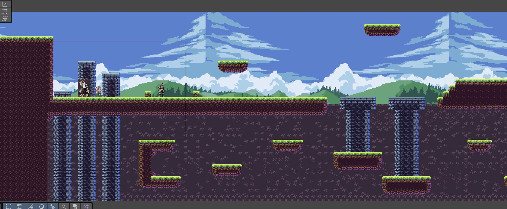
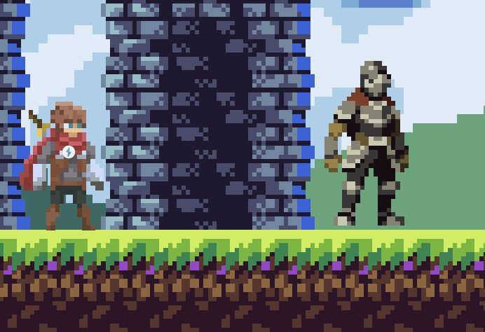
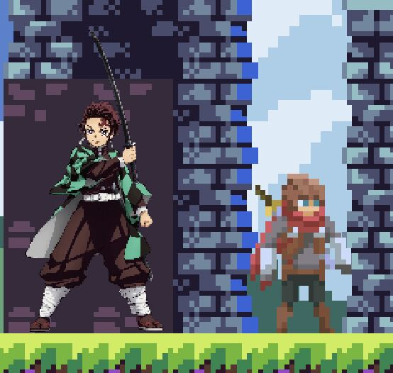
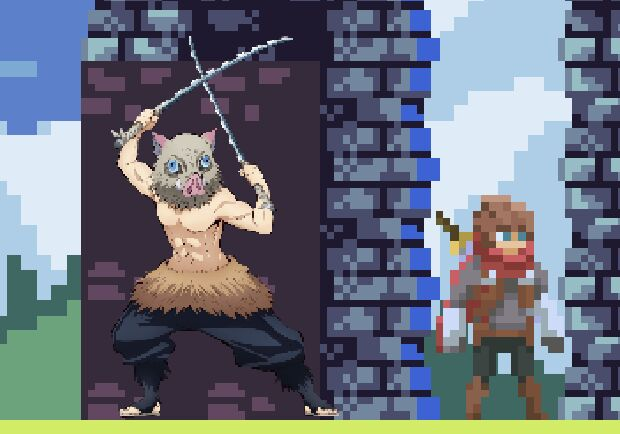
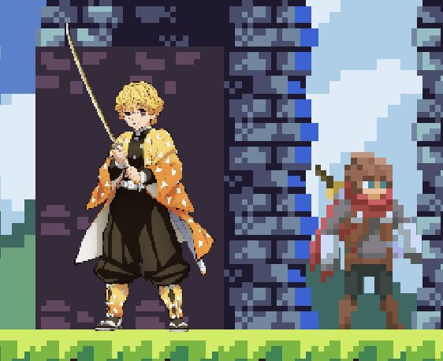

🎮 **Game Development Journey: From Unity to My First Game Concept**

Recently, I’ve started learning game development, something that’s always intrigued me and even inspired me to learn C++ years ago (although I didn’t get very far 😅). Now, diving into the world of game dev, I’ve discovered how challenging and rewarding it can be. Major respect to all game developers, especially indie devs! ✨

I kicked things off with a **Unity Flappy Bird** tutorial 🐦 to get a feel for Unity’s interface and the basics of game development. After that, I explored **Unreal Engine** by building a simple 3D game 🌆 where a character collects coins 💰 and avoids enemies in a small town. Now, I’m back to Unity, working on a **2D sidescroller tutorial**.

### What I’ve Accomplished So Far:
- 🏞 Built a small level.
- 🎭 Created a player character with animations and movement scripts.
- 👾 Developed an enemy with animations and movement script.

While working through these tutorials, I started brainstorming my own game idea, aiming for something fun, unique, and inspired by games I enjoy, such as:
- **Brotato** 🥔: A 2D hack-n-slash with great replayability.
- **Smash Bros** 💥: Characters with unique "Smash" moves.
- **Beat Saber** 🎶: Levels that react to music.

### Game Concept:
- **Genre**: Fast-paced 2D hack-n-slash sidescroller with automatic scrolling.
- **Visual Style**: Pixel art.
- **Character System**: Players equip 3 characters, but control only one at a time. They can swap characters during gameplay, each with unique abilities, weapons, and a "Smash" move that charges up during play.
- **Music & Levels**: Each level is tied to its own song, with the environment and gameplay adapting to the music.
- **Objective**: Clear the level and achieve the highest score based on enemies defeated, distance traveled, and more.
- **Fun References**: Expect some references to popular shows and games in characters, enemies, and levels!

I’ve already implemented a **character swap mechanic** 🔄, allowing players to switch characters during gameplay. Now, I’m diving deeper into learning **C# with Unity** and refining my game mechanics. It’s exciting to see my vision take shape at this early stage! 🎉

Currently, I’m stuck between two potential game names: **ZenshinSlash** or **SyncSlash**. Which one do you prefer? Let me know in the poll! Also, share your game dev experiences in the comments below! 👇